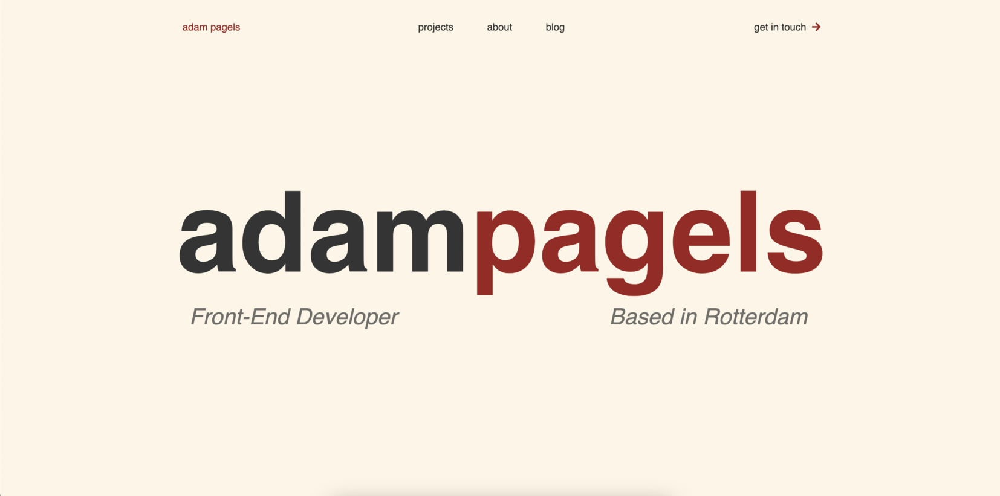

<p align="center">
  <a href="https://www.adampagels.com">
    
  </a>
</p>
<h1 align="center">
  adampagels.com
</h1>

<p align="center">
  
</p>

## 🚀 Quick start

Make sure you have NodeJS and NPM installed.

```bash
git clone https://github.com/adampagels/adampagels-portfolio
cd adampagels-portfolio
npm run start
```
